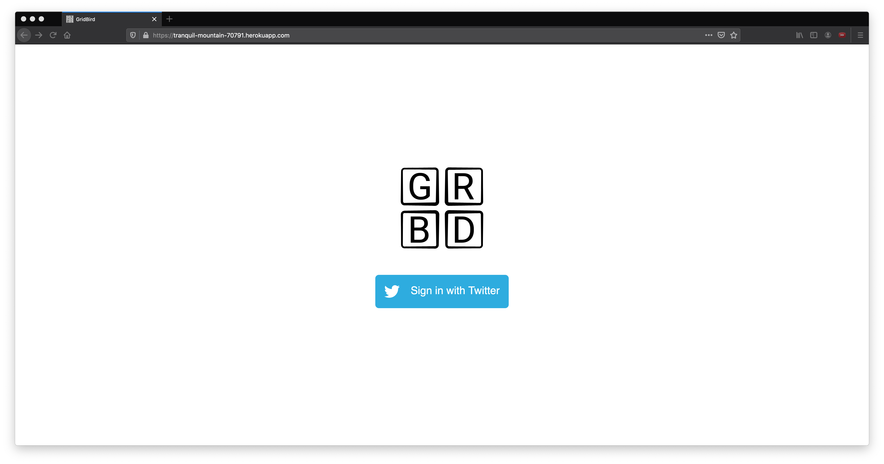

# Exploring Twitter timelines as a gallery.
## Description
Today, I deployed my very first [web application](https://tranquil-mountain-70791.herokuapp.com/).

In a nutshell, GridBird lets you view your Twitter timeline as a collection of images, as pictured below.

{:.center}

{:.center}

A friend of mine went as far as to say I had "turned Twitter into Instagram".

GridBird effectively strips a tweet of everything except its media content, and the author's profile picture, allowing
you to scroll through images without being bogged down by any opiniated tweets or annoying hashtags.

The project is comprised of a Vue frontend that interacts with a Flask backend.

The UI, including all the HTML/CSS and Javascript code, was done in Vue. This included designing responsive webpages using custom Vue components and sending AJAX calls to the backend and then updating the respective data.

The backend is several times more complex. It is based on the Flask library and serves as a closed API for the web app. It utilises the Tweepy API to communicate with Twitter. The API handles all functions from logging in, to obtaining tweets to display.

The backend and frontend are both bundled into a Docker container, and deployed on Heroku with CI/CD in the case that any changes need to be made.

## Challenges
This project was quite challenging, specifically due to the amount of new technologies I had to juggle and thus, I ran into quite a few challenges.

- Twitter's rate limits on the Home timeline are quite strict, and so I had to restrict users from accessing more tweets more than once a minute.

- Understanding JavaScript specific intricacies such as promises took some time.

- Deploying to the web was incredibly difficult to wrap my head around, especially when it came to creating Docker containers. Unfortunately, this is one aspect I still do not understand as of writing.

### [Check out GridBird!](https://tranquil-mountain-70791.herokuapp.com/)

## Gallery

{:.center}

{:.center}
